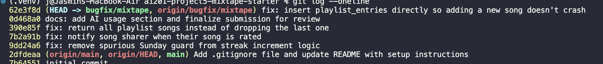

# Project 5 — Mixtape Bug Hunt: Submission

Mixtape is a social music app (JSON API, no frontend) where friends share songs,
build collaborative playlists, rate songs, and track listening streaks. It's a
Flask + SQLAlchemy app backed by SQLite (`mixtape.db`).

---

## AI Usage

I used an AI assistant throughout this project mainly as a **study partner for parts
of the codebase I wasn't sure about** — a way to get a fast, plain-English
explanation of unfamiliar code so I could then go read it myself and decide whether
the explanation held up. I deliberately did *not* ask it to "find the bugs" for me,
because a couple of times when I tried that early on it gave me confident-sounding
answers that pointed at the wrong place. My rule ended up being: I find the suspicious
code first, AI helps me understand it, then I verify by running the code.

**Where AI genuinely helped me understand something:**

- *SQLAlchemy relationships and join tables (orientation).* The `models.py`
  self-referential `friends` relationship (`primaryjoin`/`secondaryjoin`) and the
  `playlist_entries` association table with its extra `position` column were the parts
  I understood least. I pasted them in and asked "what does this relationship actually
  do and why are there two join conditions?" That explanation is what let me write the
  data-model section of the map with confidence, and it's why I knew to look at
  `position` when I got to the playlist ordering bug.
- *Issue #1 — `weekday()` vs `isoweekday()`.* Once I'd narrowed the streak bug down to
  the `today.weekday() != 6` clause by reading the function, I still wasn't 100% sure
  which day `6` was. I asked AI to explain the difference between `datetime.weekday()`
  (0=Mon…6=Sun) and `isoweekday()` (1=Mon…7=Sun). That confirmed `6` was Sunday — but
  I didn't take its word for it; I ran `datetime(2026,7,5).weekday()` in a shell and
  got `6`, and confirmed 2026-07-05 was a Sunday, before touching the code.
- *Issue #4 — comparing two similar functions.* I could see that playlist-adds
  notified but ratings didn't, so I gave AI both `add_to_playlist` and `rate_song` and
  asked "what's the structural difference between these two blocks?" It helped me
  articulate that one ends in a guarded `create_notification` call and the other just
  commits and returns. I'd already spotted the gap by reading them side by side; AI
  helped me put it into words and sanity-check that mirroring the guard
  (`song.shared_by != user_id`) was the right pattern.
- *Issue #5 — what `songs[:-1]` does.* This one I mostly knew, but I asked AI to
  confirm that a `[:-1]` slice drops the last element and returns `[]` on an empty
  list, since the empty-playlist edge case mattered for not breaking
  `test_empty_playlist_returns_empty_list`. I verified both by running it.

**Where AI was incomplete or pointed me the wrong way (and I had to check myself):**

- When I first described the search duplicate symptom (Issue #3, which I ended up not
  fixing) and asked what caused it, AI confidently said the outer join to `song_tags`
  fans out one row per tag and I just needed `.distinct()`. That's a plausible story,
  but when I actually ran `search?q=Heights` against a 3-tag song it returned the song
  **once** — because the legacy SQLAlchemy `Query` auto-uniquifies full entities. So
  the AI's explanation was the "textbook" answer but didn't match the running code.
  This was the clearest reminder to always reproduce against the real app rather than
  trust a plausible diagnosis.
- For debugging generally, AI was not much use at *locating* bugs without the full
  context — its value was explaining code I'd already found and confirming
  language/library facts. The actual navigation (route → service → the specific line)
  and every diagnosis was done by reading the call chain top-down and reproducing each
  bug in a Python shell before changing anything.

**Tools used:** an AI coding assistant for the explanations above; Python shell /
`flask`-context scripts to reproduce bugs and verify fixes; `pytest` for regression
checks; `git` for the per-fix commits.

---

## Commit history (`git log --oneline` on `bugfix/mixtape`)

Each bug fix is a separate commit with a `fix:` prefix.



```
62e3f8d fix: insert playlist_entries directly so adding a new song doesn't crash
0d468a0 docs: add AI usage section and finalize submission for review
390e85f fix: return all playlist songs instead of dropping the last one
7b2a91b fix: notify song sharer when their song is rated
9dd24a6 fix: remove spurious Sunday guard from streak increment logic
2dfdeaa Add .gitignore file and update README with setup instructions
7b64551 initial commit
```

The three required fixes are `9dd24a6` (#1), `7b2a91b` (#4), and `390e85f` (#5);
`62e3f8d` is a bonus crash fix found during review. Full root cause analyses are in
the [Milestone 2](#milestone-2--root-cause-analyses--fixes) section below.

---

## Milestone 1 — Codebase Map

### Setup confirmed

- Python 3.13, virtualenv in `.venv`, deps from `requirements.txt` installed.
- `python seed_data.py` → 5 users, 13 songs, 3 playlists, 10 tags.
- Working branch: `bugfix/mixtape`.
- Started with `FLASK_APP=app:create_app flask run` and confirmed it responds at
  `http://127.0.0.1:5000` (`GET /songs/search?q=a` → `200`, 13 results).
- **Do not** run `python app.py` — that path calls `create_app()` a second time and
  triggers a SQLAlchemy double-import/registration error. Always use the `flask run`
  invocation above.

### The main files and what each one does

**`app.py`** — The application factory. Defines the single shared
`db = SQLAlchemy()` instance and `create_app(config=None)`, which configures the
SQLite URI, registers the four blueprints under URL prefixes (`/songs`,
`/playlists`, `/users`, `/feed`), and calls `db.create_all()`. Everything imports
`db` from here, so `app.py` is the root of the import graph.

**`models.py`** — Defines the data model (details below). Imports `db` from `app`.

**`seed_data.py`** — Drops and recreates all tables, then populates realistic test
data. Notably it seeds songs with **0, 1, and 3+ tags** on purpose (to exercise the
search fan-out), listening events both recent and days-old (to exercise the feed
recency window), per-user streaks + `last_listened_at`, and one working
"song added to playlist" notification (so the correct pattern is visible when
investigating the missing "song rated" notification).

**`routes/`** — Four Flask blueprints. Each route does *only* HTTP concerns:
pull params/JSON from the request, call one service function, and format the JSON
response (including turning a service `ValueError` into a `400`/`404`). No business
logic lives here.
- `routes/songs.py` — `GET /songs/search`, `GET /songs/<id>`, `POST /songs/<id>/rate`, `POST /songs/<id>/listen`
- `routes/playlists.py` — `POST /playlists/`, `GET /playlists/<id>`, `GET /playlists/<id>/songs`, `POST /playlists/<id>/songs`
- `routes/users.py` — `GET /users/<id>`, `GET /users/<id>/streak`, `GET /users/<id>/notifications`, `POST /users/notifications/<id>/read`
- `routes/feed.py` — `GET /feed/<id>/listening-now`, `GET /feed/<id>/activity`

**`services/`** — Where all the business logic (and all five bugs) live.
- `streak_service.py` — records a listening event and increments/resets the streak.
- `feed_service.py` — "Friends Listening Now" (recent) and general activity feed.
- `search_service.py` — song search by title/artist, joined to tags.
- `notification_service.py` — creating/reading notifications, plus `add_to_playlist` and `rate_song` (the actions that *should* generate notifications).
- `playlist_service.py` — create playlist, fetch ordered playlist songs, fetch metadata.

**`tests/`** — `test_streaks.py`, `test_search.py`, `test_playlists.py` (run with `pytest tests/`).

### The data model (`models.py`)

Six models and three association tables. IDs are string UUIDs; timestamps default
to timezone-aware UTC.

**Models**
- `User` — `username`, `email`, `listening_streak`, `last_listened_at`. Has a
  self-referential many-to-many `friends` relationship (via `friendships`), plus
  backrefs to shared songs, ratings, listening events, notifications, playlists.
- `Song` — `title`, `artist`, `album`, `genre`, `shared_by` (FK→User), `shared_at`,
  `share_note`. Many-to-many `tags`.
- `Tag` — just `name` (unique).
- `ListeningEvent` — `user_id`, `song_id`, `listened_at`. This is the event log that
  drives both streaks and the feed.
- `Rating` — `user_id`, `song_id`, `score` (1–5), with a **unique constraint on
  (user_id, song_id)** — a user has at most one rating per song (re-rating updates
  it in place). There is no separate "review" entity.
- `Notification` — `user_id` (recipient), `notification_type`, `body`, `read`.

**Association tables**
- `friendships` — symmetric user↔user (seed inserts both directions).
- `song_tags` — song↔tag.
- `playlist_entries` — playlist↔song, **with extra columns**: `position` (explicit
  ordering — songs have a defined position, not just insertion order), `added_by`,
  and `added_at`. This is the interesting join table; the others are plain.

### Architecture patterns I noticed

1. **Thin routes, fat services.** Every route immediately delegates to exactly one
   service function. Parsing/validation of the *HTTP request* happens in the route;
   all domain logic + DB access happens in the service. If an endpoint misbehaves,
   the fix is almost always in `services/`, not `routes/`.
2. **`ValueError` as the not-found / bad-input channel.** Services raise
   `ValueError` ("User X not found", "Score must be between 1 and 5"); routes catch
   it and map it to a `404` (GETs) or `400` (writes). No custom exception types.
3. **One shared `db` from the factory.** All modules `from app import db`. Services
   use `db.session.get(Model, id)` for lookups and `db.session.query(...)` for
   filtered queries, and commit inside the service.
4. **Notifications are a side effect of an action, not a first-class flow.** They're
   created inline inside the action's service function (e.g. inside
   `add_to_playlist`), guarded so you don't notify yourself
   (`if song.shared_by != added_by_user_id`).
5. **Time-sensitive logic uses UTC-aware `datetime.now(timezone.utc)`** and
   defensively re-attaches `tzinfo=utc` to values read back from SQLite (which
   returns naive datetimes) — see `update_listening_streak`.

### Data flow trace #1 — adding a song to a playlist triggers a notification

This is the notification-generating path (the README's example). End to end:

1. `POST /playlists/<playlist_id>/songs` with JSON `{song_id, added_by}` hits
   `add_song()` in [routes/playlists.py](routes/playlists.py#L43). The route checks
   both fields are present (else `400`) and calls the service.
2. `add_to_playlist(playlist_id, song_id, added_by)` in
   [services/notification_service.py](services/notification_service.py#L35):
   - Loads the `Song`, the adding `User`, and the `Playlist`; raises `ValueError`
     (→ `400`) if any is missing.
   - Appends the song to `playlist.songs` **if not already present**, and commits.
   - **The notification side effect:** if the adder is *not* the person who
     originally shared the song (`song.shared_by != added_by_user_id`), it calls
     `create_notification(...)`.
3. `create_notification(user_id, type, body)` builds a `Notification` row addressed
   to `song.shared_by` with type `"song_added_to_playlist"` and commits it.
4. Later, the sharer calls `GET /users/<id>/notifications` →
   `get_notifications()` returns their notifications newest-first.

The sibling action, **rating**, is meant to mirror this: `POST /songs/<id>/rate` →
`rate_song()`. It records the rating correctly but (per the issue tracker) does
*not* currently create the parallel "your song was rated" notification — the
notification side effect that exists in `add_to_playlist` is missing from
`rate_song`.

### Data flow trace #2 — viewing the songs in a playlist

1. `GET /playlists/<playlist_id>/songs` → `get_songs()` in
   [routes/playlists.py](routes/playlists.py#L34).
2. `get_playlist_songs(playlist_id)` in
   [services/playlist_service.py](services/playlist_service.py#L38) loads the
   playlist (404 if missing), then queries `Song` joined to `playlist_entries`,
   filtered to this playlist, **ordered ascending by `position`** — so the explicit
   ordering column, not row insertion order, drives the result. It returns a list of
   `song.to_dict()`.
3. The route wraps it as `{"songs": [...], "count": N}`.

I confirmed a seeded playlist ("Late Night Vibes") was populated with 7 songs but
the endpoint returns **6**, ordered correctly by position — i.e. the ordering works,
but the tail of the list is being lost somewhere in the service.

### Data flow trace #3 — recording a listen and updating a streak

`POST /songs/<id>/listen` → `record_listening_event()` in
[services/streak_service.py](services/streak_service.py#L14): creates a
`ListeningEvent(listened_at=now)`, then calls `update_listening_streak(user, now)`,
which compares `now.date()` to `user.last_listened_at.date()`:
- never listened → streak = 1
- same day → no change
- one calendar day gap → streak += 1 (with a weekday-dependent condition in the code)
- larger gap → streak resets to 1

then commits. `GET /users/<id>/streak` just reads back `user.listening_streak`.

---

## Milestone 1 — The five open issues (from the tracker)

Read all five before choosing three to fix. Each maps to exactly one service file,
consistent with the "fat service" architecture above.

| # | Title | Service | Where to look |
|---|-------|---------|---------------|
| 1 | My listening streak keeps resetting | `streak_service.py` | `update_listening_streak` — the consecutive-day increment branch |
| 2 | Friends Listening Now shows people from yesterday | `feed_service.py` | `get_friends_listening_now` — the recency window (`RECENT_THRESHOLD`) |
| 3 | The same song keeps showing up twice in search | `search_service.py` | `search_songs` — the outer join to `song_tags` fans out rows per tag |
| 4 | Notified when a friend added my song to a playlist, but not when they rated it | `notification_service.py` | `rate_song` — missing the notification side effect that `add_to_playlist` has |
| 5 | The last song in a playlist never shows up | `playlist_service.py` | `get_playlist_songs` — the ordered result is truncated before return |

> Full issue descriptions are in the **Project 5 brief**. The table above records the
> title + owning service from `README.md` plus the specific function I'll start from
> in each file. Root-cause analysis and fixes come in the next milestone.

**Shared root-cause patterns I noticed while mapping (useful for picking three):**
- #1 and #2 are both **time/boundary** bugs (calendar-day / recency-window logic).
- #3 and #5 are both **query-shape** bugs (a join that over-produces rows; a result
  that's under-produced by slicing).
- #4 is a **missing side effect** — an action that should mirror a sibling action but
  doesn't.

**Chosen three:** #1 (time boundary), #4 (missing side effect), #5 (query shape) —
one from each pattern.

---

## Milestone 2 — Root Cause Analyses & Fixes

### Issue #1 — My listening streak keeps resetting

**How I reproduced it.** The bug is Sunday-specific, so I isolated
`update_listening_streak(user, now)` in a Python shell rather than firing HTTP
requests, and called it with the *same* one-day gap but different weekdays for `now`:
a user who "listened yesterday" (`last_listened_at = now - 1 day`) with
`listening_streak = 3`.
- `now` = Sunday 2026-07-05 → streak went **3 → 1** (wrong; a consecutive day should increment)
- `now` = Monday 2026-07-06 → streak went **3 → 4** (correct)

Same gap, only the weekday differs — that isolates the cause to a weekday check. (It
doesn't reproduce "live" today because the server clock is already Monday in UTC.)

**How I found the root cause.** Navigation path: `routes/songs.py`
(`POST /songs/<id>/listen` → `record_listening_event`) → `services/streak_service.py`.
`record_listening_event` just writes the event and delegates to
`update_listening_streak`, so the streak arithmetic all lives in that one function.
Reading its branch structure, the "listened yesterday" branch read:
`elif days_since_last == 1 and today.weekday() != 6:`. The `and today.weekday() != 6`
was the only weekday-dependent term in an otherwise purely date-arithmetic function,
and the docstring above it ("If the user listened yesterday: streak increments by 1")
mentions no weekday exception. That mismatch between the documented rule and the extra
condition is what made me confident this clause — not something deeper — was the bug.

**The root cause.** Python's `date.weekday()` returns `6` for Sunday. The increment
branch was guarded by `days_since_last == 1 and today.weekday() != 6`, so on any
Sunday the guard evaluated to `False` even for a perfectly valid consecutive-day
listen. Control then fell through to the `else` branch, which sets
`user.listening_streak = 1`. The result: a user with an active streak who listened on
consecutive days had their streak wiped every time the second day landed on a Sunday.
There is no product rule that justifies this — it was a spurious condition.

**My fix and side-effect check.** Removed the ` and today.weekday() != 6` clause so
the branch is simply `elif days_since_last == 1:`. This restores the documented
behavior: a one-calendar-day gap always increments regardless of weekday.
Side-effect checks (all in an isolated shell): a consecutive-day listen now yields `4`
on **all seven weekdays**; `days_since_last == 0` still returns unchanged (`3`);
a two-day gap still resets to `1`; and a first-ever listen (`last_listened_at is None`)
still starts at `1`. `pytest tests/test_streaks.py` → 5 passed.

**AI usage.** After I'd already located the clause by reading the function, I used AI
to confirm one fact: that `datetime.weekday()` returns 0=Monday…6=Sunday (vs
`isoweekday()`'s 1–7). I verified it myself by printing
`datetime(2026,7,5).weekday()` → `6`. AI did not find the bug; it confirmed a
convention after I'd narrowed it down.

### Issue #4 — Notified when a friend added my song to a playlist, but not when they rated it

**How I reproduced it.** In a Python shell against seeded data: nova rated a song
shared by simone (`rate_song(nova.id, song.id, 5)`) and then read simone's
notifications with `get_notifications(simone.id)`. Count stayed at 0. As a control in
the same session, I had nova *add* one of simone's songs to a playlist
(`add_to_playlist`) — simone's count went 0 → 1. So the reported asymmetry was real:
adding notifies, rating doesn't.

**How I found the root cause.** Navigation path: `routes/songs.py`
(`POST /songs/<id>/rate` → imported from `notification_service`) →
`services/notification_service.py`. The fact that *playlist* notifications worked but
*rating* ones didn't told me to compare the two sibling functions in that same file.
`add_to_playlist` ends with a guarded `create_notification(...)` call
(`if song.shared_by != added_by_user_id:`). `rate_song` has the same shape up front
(loads `song`, loads `rater`, commits) but its final statements are just
`db.session.commit()` / `return rating` — the notification step present in its sibling
is simply absent. Seeing the two functions side by side, with one having the
side effect and the other missing it, is what made me confident.

**The root cause.** `rate_song` correctly creates/updates the `Rating` row but never
calls `create_notification`, so the song's original sharer is never told their song
was rated. It's a missing side effect, not a logic error — the notification
infrastructure (`create_notification`, the `Notification` model, the
`GET /users/<id>/notifications` retrieval path) all work; `rate_song` just never
invokes it. (The seed data's one "playlist add" notification is inserted directly,
which is why the feature *looked* half-working.)

**My fix and side-effect check.** After the commit in `rate_song`, added a guarded
`create_notification` mirroring `add_to_playlist`: notify `song.shared_by` with type
`"song_rated"` (the exact type string the `create_notification` docstring already
lists) only when `song.shared_by != user_id` (so rating your own song doesn't notify
you). Verified: a non-self rating adds exactly one `song_rated` notification with a
correct body; re-rating (the existing-`Rating` update path) also notifies; rating your
own song adds zero. The full suite went from 11 passed to 11 passed + the 2
pre-existing `test_playlists.py` failures, which are Issue #5 (unrelated to this file)
and are fixed in the next entry.

**AI usage.** None needed for diagnosis — the fix was found by direct side-by-side
reading of the two sibling functions. I only asked AI to sanity-check that notifying
inside the `existing` (re-rating) branch as well as the new-rating branch was
reasonable; I decided to place the call after the shared commit so both paths notify.

### Issue #5 — The last song in a playlist never shows up

**How I reproduced it.** For every seeded playlist I compared the number of rows in
the `playlist_entries` join table to what the service returned:
`db.session.query(playlist_entries).filter(...).count()` vs
`len(get_playlist_songs(pl.id))`. Every playlist had 7 entries but the service
returned 6, and the missing one was always the highest-`position` (last) song — e.g.
"Late Night Vibes" stopped at "Golden Hour". The `test_playlists.py` tests
(`test_playlist_returns_all_songs` expects 5, `test_playlist_returns_songs_in_order`
expects `Track 1..5`) failed the same way, confirming it independently.

**How I found the root cause.** Navigation path: `routes/playlists.py`
(`GET /playlists/<id>/songs` → `get_songs`) → `services/playlist_service.py`
(`get_playlist_songs`). The route just wraps the service list in
`{"songs", "count"}`, so the truncation had to be in the service. Reading
`get_playlist_songs`, the query itself was correct — it joins `playlist_entries` and
orders ascending by `position`, and my repro confirmed the *ordering* was right and
only the tail was missing. That pointed straight at the return statement:
`return [song.to_dict() for song in songs[:-1]]`. The `[:-1]` slice drops the last
element of an already-correct, already-ordered list. The "off by exactly one, always
the last" symptom matching a `[:-1]` slice is what made it certain.

**The root cause.** The query returns the full, correctly ordered list of songs, but
the list comprehension iterates over `songs[:-1]` instead of `songs`. `[:-1]` returns
every element except the last, so the final (highest-position) song in every
non-empty playlist is silently discarded. (The docstring even says "This function
returns all songs in the playlist," which the code contradicted.)

**My fix and side-effect check.** Changed `songs[:-1]` to `songs` so the comprehension
returns all rows. Boundary checks: non-empty playlists now return all 7 seeded songs
in position order with the correct last song; and the empty-playlist case is safe —
`songs` is `[]`, so it returns `[]` (matching `test_empty_playlist_returns_empty_list`;
note the old `[][:-1]` was also `[]`, so this edge was never the visible symptom). Full
suite: **13 passed** (the two previously-failing playlist tests now pass, no
regressions elsewhere).

**AI usage.** None. This was a one-line slice bug found by reading the function after
the repro localized the loss to "always exactly the last element."

---

## Summary of fixes

| Issue | File | One-line change | Tests |
|-------|------|-----------------|-------|
| #1 | `services/streak_service.py` | removed spurious `and today.weekday() != 6` from the increment branch | 5/5 streak |
| #4 | `services/notification_service.py` | added guarded `create_notification("song_rated", ...)` in `rate_song` | no regressions |
| #5 | `services/playlist_service.py` | `songs[:-1]` → `songs` in `get_playlist_songs` | 2 playlist tests now pass |

Final state: `pytest tests/` → **13 passed**. Each fix is a separate commit on
`bugfix/mixtape` using conventional-commit messages.

### Bonus — bug found while reviewing (not in the issue tracker)

**Issue B1 — Adding a *new* song to a playlist crashes with an IntegrityError**

**How I found it.** While building the Issue #4 reproduction I tried to add a song
that wasn't already in a playlist via `add_to_playlist`, and it raised
`sqlite3.IntegrityError: NOT NULL constraint failed: playlist_entries.position`.
This isn't one of the five tracked issues, but it's a genuine crash on a core action
(`POST /playlists/<id>/songs`), so I fixed it.

**The root cause.** `add_to_playlist` added the song with
`playlist.songs.append(song)`. `Playlist.songs` is a relationship whose secondary is
the `playlist_entries` association table, and that table has **NOT NULL** `position`
and `added_by` columns with no defaults. The ORM relationship only knows how to write
`playlist_id`, `song_id`, and the defaulted `added_at` — it has no way to supply
`position`/`added_by` — so the INSERT violated the `position` NOT NULL constraint.
(The seed data never hit this because it inserts into `playlist_entries` directly with
an explicit `position`.)

**My fix and side-effect check.** Replaced the relationship append with a direct
`playlist_entries.insert()` that supplies `position = max(existing position) + 1` and
`added_by = added_by_user_id`, guarded by a membership check against the association
table so re-adding is idempotent. Verified: adding a new song now succeeds, lands at a
contiguous position (a 7-song playlist grew to positions `[1..8]`), the sharer gets
their `song_added_to_playlist` notification, the new song shows up in
`get_playlist_songs` (as the last entry, working alongside the Issue #5 fix), and
re-adding the same song neither duplicates nor crashes. `pytest tests/` → 13 passed.

**AI usage.** I asked AI to explain *why* appending through a `secondary` relationship
can't populate extra association-table columns; it confirmed that SQLAlchemy's
secondary-relationship writes only manage the two FK columns and that the documented
pattern for association tables with extra data is either an explicit insert or an
association-object model. I chose the explicit insert to match how `seed_data.py`
already writes these rows.
